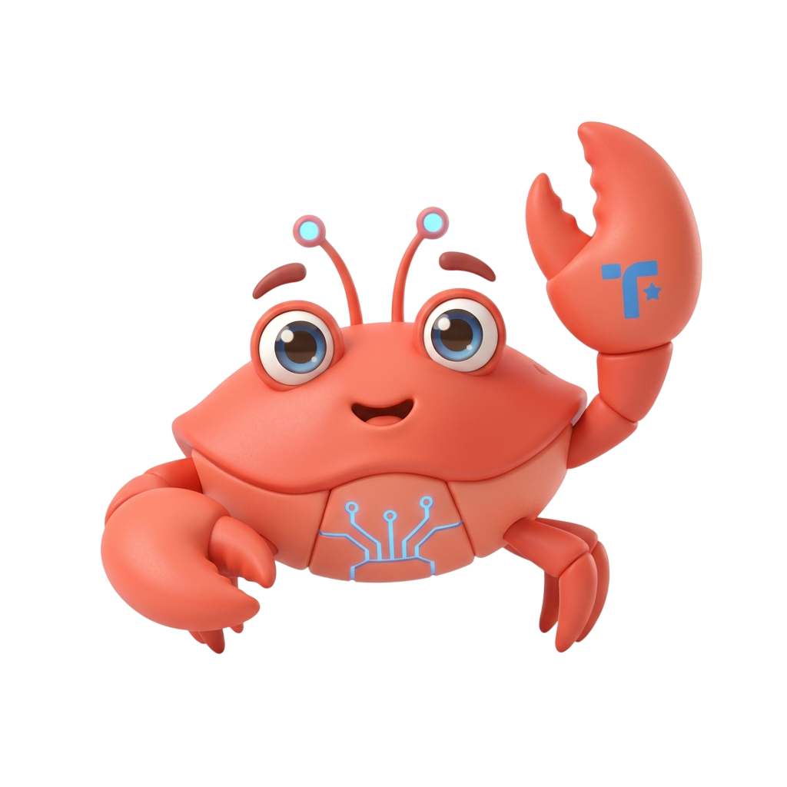

# CrabClip 🦀

  
  
  **Instantly share text & files securely with a 4-digit code**
  
  No signup. No tracking. Auto-deletes after retrieval.

---

## What is CrabClip?

CrabClip is a **secure, anonymous clipboard** for sharing content instantly. 

1. **Paste** your text or file
2. **Get** a secure 4-digit code
3. **Share** the code with anyone
4. They **retrieve** your content
5. It **auto-deletes** — gone forever

Perfect for sharing passwords, API keys, documents, and temporary notes.

---

## ✨ Features

- 🔐 **Secure** - OTP protected
- ⚡ **Fast** - Instant sharing, no signup required
- 🎯 **Anonymous** - No tracking, no accounts
- 📱 **Mobile Friendly** - Works on any device
- 🎨 **Minimalist Design** - Clean, responsive UI with seamless dark/light mode toggle
- 🗑️ **Auto-Delete** - Content expires automatically
- 🛡️ **Rate Limited** - Database-level protection against spam and brute-force attacks

---

## 🔒 Security

✅ OTPs hashed with SHA-256  
✅ Guaranteed unique OTP generation (collision safe)
✅ One-time access enforcement  
✅ Automatic TTL-based deletion (MongoDB indexes)
✅ Distributed Rate limiting (5 creates/5min, 10 retrieves/5min)  
✅ CORS enabled (configurable)  

---

## ❓ FAQ

**Q: How long does content stay?**  
A: Default 5 minutes. Customizable to 1 hour or 24 hours.

**Q: Can I retrieve multiple times?**  
A: No. Content is deleted immediately after first retrieval.

**Q: Why do you need my OTP?**  
A: To fetch your specific content. It's encrypted and hashed.

---

## 📧 Need Help?

Open an issue or reach out!

---

  Built with ❤️ — Crafted by <a href="https://github.com/akanupam">akanupam</a>

